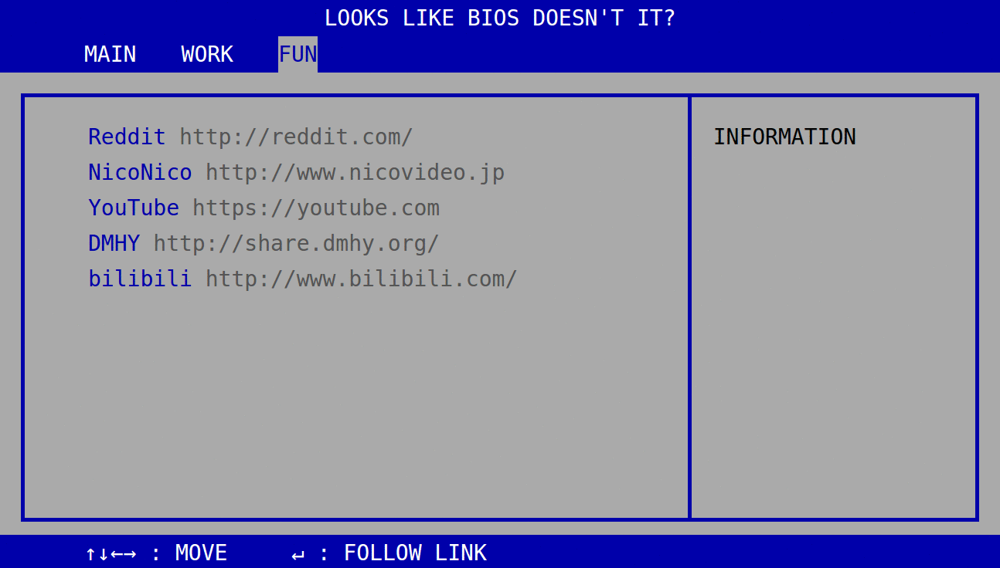

# Start page BIOS

A start page that looks like BIOS screen.

## Screenshot



## Getting Started

The page can be built locally. If you just want the generated HTML file,
see the `/demo` folder.

### Prerequisite

1. `npm` or `yarn` to install the dependencies
2. `gulp` to compile the HTML file
3. `webpack` to compile the JS and CSS

### Installation

1. Run `npm install` or `yarn install`

### Development

To develop it on your local machine, run:

``` bash
$ gulp
```

meanwhile on another terminal:

``` bash
$ npm run serve
```

You can see the page from [http://localhost:8080](http://localhost:8080)
or [http://localhost:8080/webpack-dev-server/](http://localhost:8080/webpack-dev-server/).

### Deployment

You can pack this start page as a Chrome extension for new tabs.

``` bash
$ gulp build
$ webpack -p
```

You will find inside `/output` there are 3 files, `index.html`,
`bundle.js`, and `manifest.json`. To pack the page as an extension,
follow the [official guide](https://developer.chrome.com/extensions/packaging).
